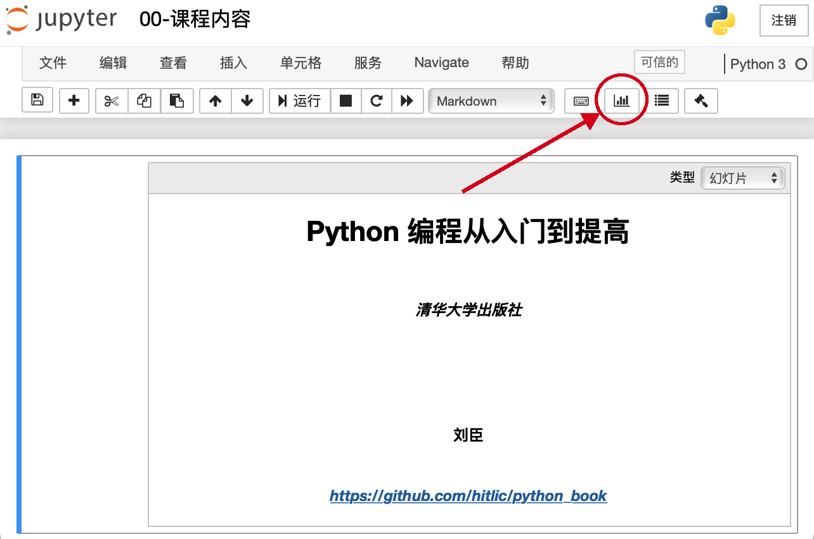

# Python编程从入门到提高
清华大学出版社《Python编程从入门到提高》源代码及课件。

## 内容

- 源代码
  - `codes`
- 课件：Jupyter notebook格式的幻灯片
  - `notebook_slides`

## 课件使用

详细说明参见`notebook_slides/课件使用说明.md`。

### 仅使用Notebook显示

- 安装Jupyter和autopep8
  - 使用pip：`pip install jupyter autopep8`
  - 使用conda：`conda install jupyter autopep8`
- 为了配置方便，建议安装Jupyter Nbextensions Configurator
  - 使用pip
    - `pip install jupyter_nbextensions_configurator`
    - `jupyter nbextensions_configurator enable --user`
  - 使用conda
    - `conda install -c conda-forge jupyter_nbextensions_configurator`
- 运行jupyter notebook
  - 在终端进入课件所在目录
  - 运行命令`jupyter notebook .`即可

### 使用幻灯片显示

- 安装Jupyter和autopep8
  - 使用pip：`pip install jupyter autopep8`
  - 使用conda：`conda install jupyter autopep8`

- 安装RISE插件
  - 使用pip：`pip install RISE`

  - 使用conda：`conda install -c conda-forge rise`
- 为了配置方便，建议安装Jupyter Nbextensions Configurator
  - 使用pip
    - `pip install jupyter_nbextensions_configurator`
    - `jupyter nbextensions_configurator enable --user`
  - 使用conda
    - `conda install -c conda-forge jupyter_nbextensions_configurator`

- 运行jupyter notebook

  - 在终端进入课件所在目录
  - 运行命令`jupyter notebook .`

- 在弹出的浏览器中选择一个课件打开，点击下图所示的图标即可以幻灯片形式显示

  

      
  

  
