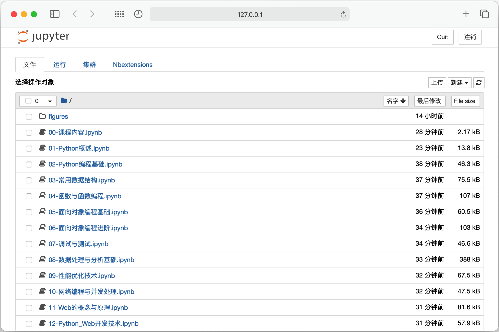
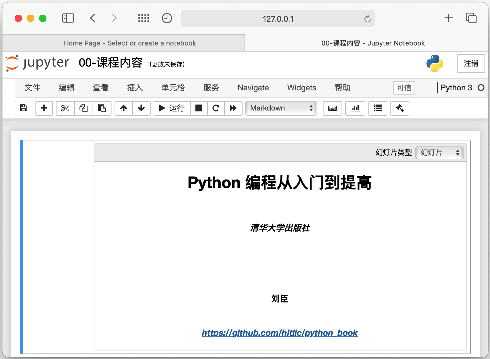
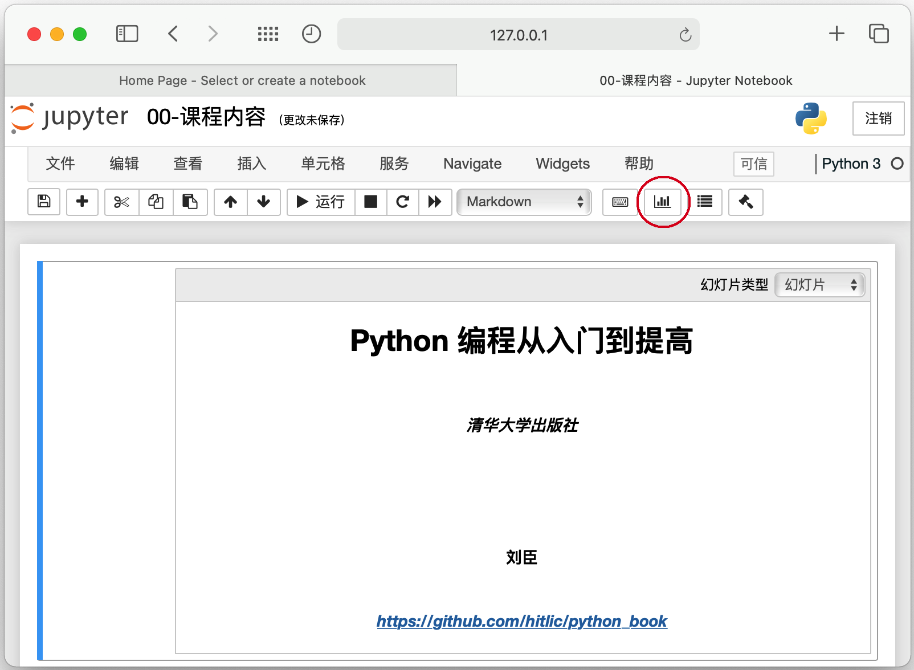
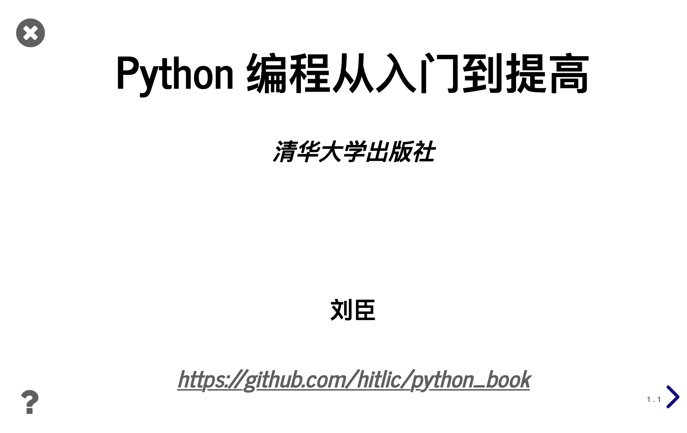

# 使用说明

### 仅使用Notebook显示

- 安装Jupyter和autopep8 
  - 使用pip：`pip install jupyter autopep8`
  - 使用conda：`conda install jupyter autopep8`
- 为了配置方便，建议安装Jupyter Nbextensions Configurator
  - 使用pip
    - `pip install jupyter_nbextensions_configurator`
    - `jupyter nbextensions_configurator enable --user`
  - 使用conda
    - `conda install -c conda-forge jupyter_nbextensions_configurator`
- 打开课件
  - 进入课件所在目录
  - 打开notebook：`jupyter notebook .`

    

    

### 使用幻灯片显示

- 安装Jupyter和autopep8
  - 使用pip：`pip install jupyter autopep8`
  - 使用conda：`conda install jupyter autopep8`

- 安装RISE插件
  - 使用pip：`pip install RISE`

  - 使用conda：`conda install -c conda-forge rise`
- 为了配置方便，建议安装Jupyter Nbextensions Configurator
  - 使用pip
    - `pip install jupyter_nbextensions_configurator`
    - `jupyter nbextensions_configurator enable --user`
  - 使用conda
    - `conda install -c conda-forge jupyter_nbextensions_configurator`

- 打开课件
  - 进入课件所在目录
  - 打开notebook：`jupyter notebook .`
  - 点击红圈所示的链接（或者使用快捷键Alt+R）以幻灯片的方式显示当前页面

    

- 最大化浏览器窗口，可显示如下图所示的幻灯片页面
   -  可通过放大或缩小来调整幻灯片的显示
   -  部分页面可上下滚动显示

    

- RISE常用快捷链
  - 空格：下一页
  - Shift+空格：上一页
  - W：浏览幻灯片列表

